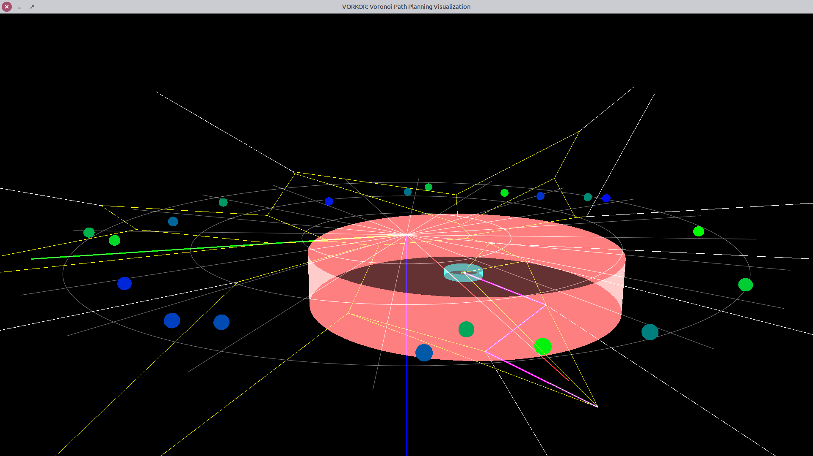

# vorkor
Voronoi path planning and obstacle avoidancce with voronoi graphs. Projected collaboration project with Dr. Kim in South Korea.
Continuation of Laith Sahawneh's dissertation.

Repository imported from the [MAGICC Lab repository](https://magiccvs.byu.edu/gitlab/betaBison/vorkor) on GitLab to preserve
history and editing privledges.

